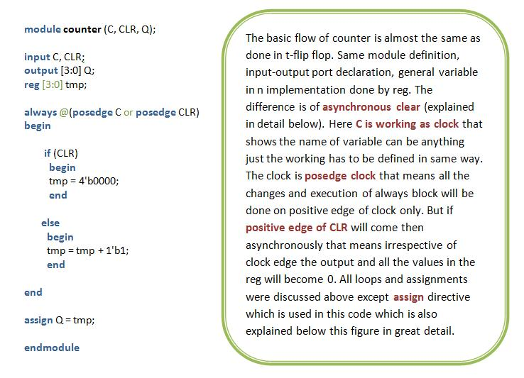

This page provides an overview of Verilog, its significance, and practical examples of digital design using Verilog. We will explore three fundamental designs in this experiment:

1. **T-Flip Flop**
2. **Counter**
3. **T-Flip Flop Using D-Flip Flop**

---

Verilog is a hardware description language (HDL) developed to model electronic systems. It enables designers to describe the structure and behavior of digital circuits, facilitating simulation, synthesis, and verification. The modular nature of Verilog allows for efficient design, testing, and reuse of code.

---

## 1. T-Flip Flop

The Verilog code for a T-Flip Flop is shown below, accompanied by an explanation of its components:

<p align="center">
  
</p>

### Key Concepts

- **Module:**  
  A module is the fundamental building block in Verilog. It can represent a single element or a collection of lower-level design blocks. Modules encapsulate functionality and expose interfaces through input and output ports, allowing for abstraction and reuse.

- **Module Name:**  
  The module name is user-defined and is used to instantiate the module elsewhere in the design. Instantiation is demonstrated in the third example.

- **Module Arguments:**  
  Similar to function arguments in C, module arguments specify the input and output ports used for communication with other modules or the external environment.

- **Input/Output Ports:**  
  These ports facilitate data transfer into and out of the module. All arguments listed in the module declaration must be defined as either input or output within the module.

- **Data Types:**  
  In this example, the `reg` data type is used. Other data types, such as `wire`, will be introduced in subsequent examples. Refer to the chart below for an overview of Verilog data types:

  <p align="center">
    
  </p>

- **Always Block:**  
  The `always` block contains statements that execute repeatedly, triggered by changes in specified signals (e.g., clock or reset).

- **Posedge Clock:**  
  The `posedge` (positive edge) of the clock triggers the execution of statements within the `always` block, corresponding to a transition from low to high voltage.

- **Negedge Reset:**  
  The `negedge` (negative edge) of the reset signal asynchronously sets the output to zero, regardless of the clock.

- **Operators and Lexical Conventions:**  
  Operators such as `~` (bitwise NOT) and `!` (logical NOT) are used in Verilog. The chart below summarizes various operators and conventions:

  <p align="center">
    
  </p>

- **Loops:**  
  Verilog supports control structures such as `for`, `if-else`, and `while`, similar to C. These structures use `begin` and `end` to define statement blocks.

- **Blocking and Non-Blocking Assignments:**
  - **Blocking (`=`):** Statements execute sequentially.
  - **Non-Blocking (`<=`):** Statements execute concurrently.  
    For example:
    ```
    a = b;
    b = a;
    ```
    Both `a` and `b` will have the value of `b`.  
    Using non-blocking assignment:
    ```
    a <= b;
    b <= a;
    ```
    The values are swapped simultaneously.

---

## 2. Counter

The Verilog code for a counter is provided below, with explanations for each part:

<p align="center">
  
</p>

### Additional Notes

- **Assign Statement:**  
  The `assign` keyword is used for continuous assignment. For example, `assign Q = tmp;` ensures that `Q` is updated immediately whenever `tmp` changes, regardless of execution sequence.

---

## 3. T-Flip Flop Using D-Flip Flop

The Verilog code for implementing a T-Flip Flop using a D-Flip Flop is shown below:

<p align="center">
  
</p>

### Key Concepts

- **Module Instantiation:**  
  Modules are not defined within other modules; instead, they are instantiated (called) as needed. The module is referenced by its original name, but each instance must have a unique identifier. For example, the module `D_FF` is instantiated as `dff0`.

- **Verilog Primitives:**  
  Verilog provides built-in primitives such as `not`. In `not (d, q);`, `d` is the output and `q` is the input.

- **Compiler Directives and System Tasks:**  
  While not used in the above examples, Verilog supports compiler directives and system tasks for advanced functionality. Refer to the flowcharts below for more information:

  <p align="center">
    
  </p>
  <p align="center">
    
  </p>

---

## Counter

Counter circuits are fundamental digital building blocks that typically count in natural binary. Many types of counters are available, such as those implemented in the 4000 series of integrated circuits. In some applications, alternative counting sequences like binary-coded decimal (BCD), linear feedback shift register, or Gray code are preferred. Counters are widely used in digital clocks, timers, and various electronic devices.

In this experiment, counters are constructed using two 74LS73 dual J-K flip-flop chips and a 74LS02 quad NOR chip. Each flip-flop features an asynchronous reset (R’) input in addition to the synchronous J-K inputs. The asynchronous reset allows any flip-flop to be reset by setting R’ = 0, regardless of the clock (CK) input. This feature is used to initialize the flip-flop outputs and to create counters with cycle lengths less than 16.

### Pin Connections

<p align="center">
  
</p>

### Basic Counter (Binary Ripple Counter)

1. Set J = K = 1 for all flip-flops, converting each J-K flip-flop into a T flip-flop. Connect all R’ inputs together to an input switch, and connect outputs Q0, Q1, Q2, Q3 to four LED displays.
2. For an up-counting binary ripple counter, connect the clocks as follows: CK0 = Manual Clock (CLK-M), CK1 = Q0, CK2 = Q1, CK3 = Q2.
3. Use the input switch connected to the common R’ input to initialize the counter.
4. Apply manual clock pulses and record the state sequence for a complete cycle.
5. To configure a down-counting binary ripple counter, change the clock connections to CK1 = Q0’, CK2 = Q1’, CK3 = Q2’.

### Asynchronous (Ripple) Counter

An asynchronous (ripple) counter consists of a single JK-type flip-flop with its J input connected to its own inverted output. This circuit stores one bit and counts from 0 to 1 before overflowing. Each clock cycle increments the counter, alternating between 0 and 1. The output produces a new clock signal with a 50% duty cycle at half the frequency of the input clock. Cascading such flip-flops yields multi-bit counters.

| Cycle | Q1 | Q0 | (Q1:Q0)<sub>dec</sub> |
|-------|----|----|-----------------------|
| 0     | 0  | 0  | 0                     |
| 1     | 0  | 1  | 1                     |
| 2     | 1  | 0  | 2                     |
| 3     | 1  | 1  | 3                     |
| 4     | 0  | 0  | 0                     |

### Synchronous Counter

In a synchronous counter, each bit toggles when all less significant bits are at logic high. For example, bit 1 toggles when bit 0 is high; bit 2 toggles when both bits 1 and 0 are high, and so on. Synchronous counters can also be implemented using hardware finite state machines for smoother and more stable transitions.

### Decade Counter

A decade counter counts in decimal digits (0–9) rather than binary. It may use binary-coded decimal (BCD) encoding, bi-quinary encoding, or a fully decoded (one-hot) output. Decade counters are used in multiplexers, demultiplexers, and scanning applications. A mod-10 counter (decade counter) cycles through 0 to 9. For a 4-bit binary counter, the decade sequence can be achieved by setting R’ = (Q3 • Q1)’ for all flip-flops, forcing the counter to reset to 0000 after reaching 1001 (decimal 9).

### Decade Synchronous Counter

The J-K inputs for a decade synchronous counter are as follows:  
- J0 = K0 = 1  
- J1 = Q0 • Q3’, K1 = Q0  
- J2 = K2 = Q0 • Q1  
- J3 = Q0 • Q1 • Q2, K3 = Q0

### Ring Counter

A ring counter is a type of shift register where the output of the last flip-flop is connected to the input of the first. In a 3-bit ring counter, the preset and clear inputs are used to initialize the state. The logic ensures that only one flip-flop output is high at any time, and this '1' circulates with each clock pulse, forming a ring pattern.

| Cycle | Q1 | Q2 | Q3 |
|-------|----|----|----|
| 0     | 1  | 0  | 0  |
| 1     | 0  | 1  | 0  |
| 2     | 0  | 0  | 1  |
| 3     | 1  | 0  | 0  |
| 4     | 0  | 1  | 0  |
| 5     | 0  | 0  | 1  |
| 6     | 1  | 0  | 0  |

### Multipurpose 4-bit Synchronous Counter

The CD4029 is a versatile 4-bit counter that can operate in binary or BCD mode and in up or down counting modes, depending on the control inputs B/D’ and U/D’. The 4-bit output Q3Q2Q1Q0 can be preset to any value by applying the desired bits to D3D2D1D0 and setting the Set Enable (SEN) control to 1.

<p align="center">
  
</p>